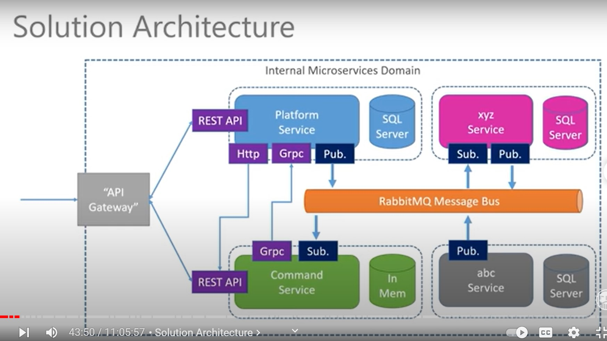

# STEP BY STEP: DOTNET Microservices ******

## What the course covers

1. Intro & Theory
2. Starting the platform service
3. Docker & Kubernetes
4. Starting the commands service
5. sql server
6. multi-resource api
7. message bus/rabbitmq
8. asynchronous messaging
9. grpc

### Microservices: What are they and how are they saving the world?

> > Gather together those things that change for the same reason, and seperate those things that change for different reasons. - Robert C Martin

* Microservices are small (typically 2 weeks of work)
* Responsible for doing 1 thing well. (doesn't rely too much on other parts of the system)
* Organisationally aligned.
* Forms part of the (distrubuted) whole
* Self-contained / Autonomous

#### Solution Architecture

##### PLATFOTM SERVICE ARCHITECTURE

